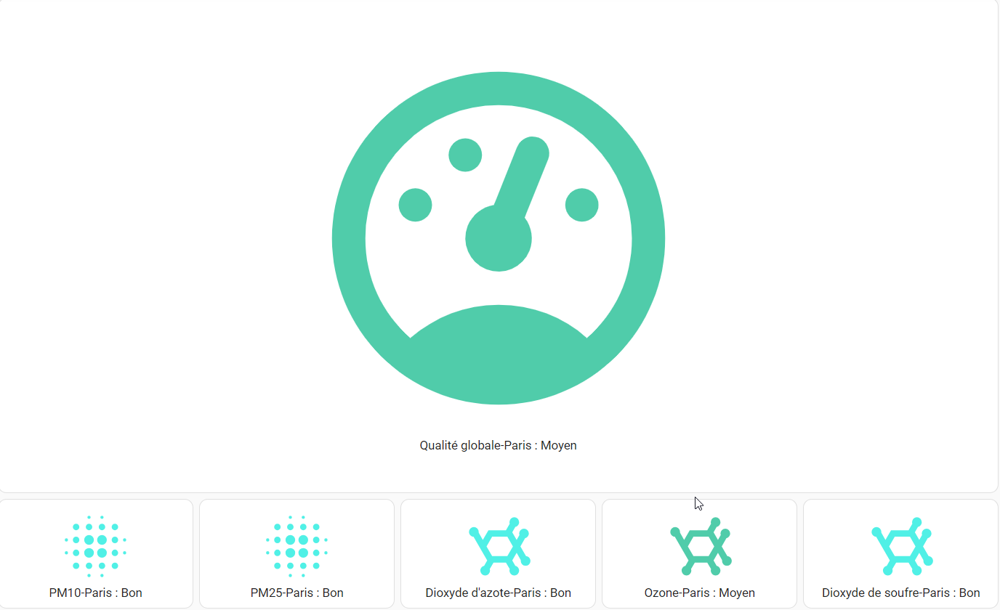

# Atmo France pour Home Assistant

Composant pour exposer les niveaux de pollution prévus pour le jour même.

Données fournies par Atmo France et les agences régionales.
Voir https://www.atmo-france.org/ pour l'accès web.

L'intégration expose les données d'Atmo France pour une commune donnée.
Les données exposées sont :
- Niveau de pollution Dioxyde d'Azote (NO<sub>2</sub>)
- Niveau de pollution Ozone (O<sub>3</sub>)
- Niveau de pollution Dioxyde de Soufre (SO<sub>2</sub>)
- Niveau de pollution Particules fines <2.5 µm (Pm25)
- Niveau de pollution Particules fines <10 µm (Pm10)
- Niveau global de qualité de l'air

## Installation

Utilisez [HACS](https://hacs.xyz/).
[](https://my.home-assistant.io/redirect/hacs_repository/?owner=sebcaps&repository=atmofrance&category=integration)

## Configuration

### Obtenir un accès pour les API Atmo France

- Faire une demande de compte sur le [site Atmo France](https://admindata.atmo-france.org/inscription-api),
- Une fois le compte créé, initialiser le mot de passe via le lien envoyé par mail.
- Ces identifiants (login / mot de passe) sont ceux à utiliser pour la configuration du composant dans Home Assistant.

### Configuration dans Home Assistant

La méthode de configuration consiste à utiliser l'interface utilisateur.

Il faut tout d'abord saisir ses [identifiants d'accès](#obtenir-un-accès-pour-les-api-atmo-france) à l'API.


Puis sélectionner le code postal de la commune dont on souhaite obtenir les données.


>**Note :**
>L'API se base sur le code INSEE. La récupération du code INSEE se fait via l'intégration, mais il peut y avoir plusieurs communes (donc plusieurs codes INSEE) pour un même code postal. Dans ce cas, une étape supplémentaire demande de préciser la commune (sélectionnable dans une liste) pour ne récupérer qu'un code INSEE.


### Données

Les informations présentées sont les niveaux de pollution sur une échelle de 1 (Bon) à 6 (Extrêmement Mauvais), avec 0 (Indisponible) et 8 (événement).

Les attributs suivants sont disponible:
- Le libellé du niveau
- La date et heure (UTC) de la mise à jour des données par AtmoFrance. **Les données sont mises à jour une fois par jour par Atmo France.**
- La couleur associée au niveau de pollution (couleurs 'officielles' d'atmo france, au format hexadécimal)


### Suggestion d'affichage



:warning: **Prérequis** Cet affichage se base sur les composants:
 - [custom-button-card](https://github.com/custom-cards)
 - [decluttering-card](https://github.com/custom-cards/decluttering-card)

Se référer à la doc de chacun des composants pour les détails.


Configuration *modèle decluttering*
```  yaml
decluttering_templates:
    atmofrance:
        card:
        type: custom:button-card
        entity: '[[sensor]]'
        name: |
            [[[
            return entity.attributes.friendly_name +' : ' + entity.attributes.Libellé
            ]]]
        styles:
            icon:
            - color: '[[[return entity.attributes.Couleur]]]'
```

Configuration du dashboard principal :
``` yaml
type: vertical-stack
cards:
  - type: custom:decluttering-card
    template: atmofrance
    variables:
      - sensor: sensor.qualite_globale_paris
  - type: horizontal-stack
    cards:
      - type: custom:decluttering-card
        template: atmofrance
        variables:
          - sensor: sensor.pm10_paris
      - type: custom:decluttering-card
        template: atmofrance
        variables:
          - sensor: sensor.pm25_paris
      - type: custom:decluttering-card
        template: atmofrance
        variables:
          - sensor: sensor.dioxyde_d_azote_paris
      - type: custom:decluttering-card
        template: atmofrance
        variables:
          - sensor: sensor.ozone_paris
      - type: custom:decluttering-card
        template: atmofrance
        variables:
          - sensor: sensor.dioxyde_de_soufre_paris
```