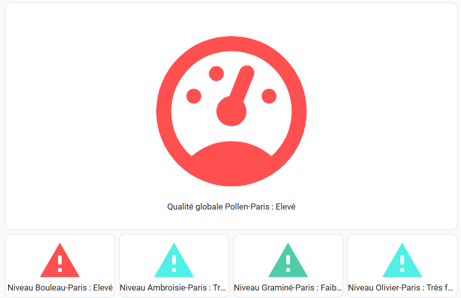

# Atmo France pour Home Assistant


Composant pour exposer les niveaux de pollution atmosphérique et alerte pollen prévus pour le jour même et le lendemain.

Données fournies par Atmo France et les agences régionales.
Voir https://www.atmo-france.org/ pour l'accès web.

L'intégration expose les données d'Atmo France pour une commune donnée.
Les données exposées pour la pollution de l'air sont :
- Niveau de pollution Dioxyde d'Azote (NO<sub>2</sub>)
- Niveau de pollution Ozone (O<sub>3</sub>)
- Niveau de pollution Dioxyde de Soufre (SO<sub>2</sub>)
- Niveau de pollution Particules fines <2.5 µm (Pm25)
- Niveau de pollution Particules fines <10 µm (Pm10)
- Niveau global de qualité de l'air

Les données exposées pour les pollens  sont :
- Concentration en Ambroisie (µg/m<sup>3</sup>)
- Concentration en Armoise (µg/m<sup>3</sup>)
- Concentration en Aulne (µg/m<sup>3</sup>)
- Concentration en Bouleau (µg/m<sup>3</sup>)
- Concentration en Graminé (µg/m<sup>3</sup>)
- Concentration en Olivier (µg/m<sup>3</sup>)
- Niveau Ambroisie
- Niveau Armoise
- Niveau Aulne
- Niveau Bouleau
- Niveau Graminé
- Niveau Olivier
- Qualité globale Pollen

Sont disponibles , les données pour le jour courant (J) ainsi que les prévisions pour le jour suivant (J+1).

> [!IMPORTANT]
> Prévisions disponible à J+1. Sous réserves de présence effective des données.
>
> Les données étant rafraichies à 12h00, entre 00h00 et 12H00 du jour J, les données à J+2 ne sont pas disponibles.
>
> C'est pour cette raison que les prévisions à J+2 ne sont pas implémentés.


## Installation

Utilisez [HACS](https://hacs.xyz/).
[](https://my.home-assistant.io/redirect/hacs_repository/?owner=sebcaps&repository=atmofrance&category=integration)

## Configuration

### Obtenir un accès pour les API Atmo France

- Faire une demande de compte sur le [site Atmo France](https://admindata.atmo-france.org/inscription-api),
- Une fois le compte créé, initialiser le mot de passe via le lien envoyé par mail.
- Ces identifiants (login / mot de passe) sont ceux à utiliser pour la configuration du composant dans Home Assistant.

### Configuration dans Home Assistant

La méthode de configuration consiste à utiliser l'interface utilisateur.

Il faut tout d'abord saisir ses [identifiants d'accès](#obtenir-un-accès-pour-les-api-atmo-france) à l'API.


Puis sélectionner le code postal de la commune dont on souhaite obtenir les données.


>**Note :**
>L'API se base sur le code INSEE. La récupération du code INSEE se fait via l'intégration, mais il peut y avoir plusieurs communes (donc plusieurs codes INSEE) pour un même code postal. Dans ce cas, une étape supplémentaire demande de préciser la commune (sélectionnable dans une liste) pour ne récupérer qu'un code INSEE.


>**Note:**
> Pour certaines région (Occitanie, Bretagne), les données sont disponibles au niveau de l'[EPCI](https://www.insee.fr/fr/metadonnees/definition/c1160#:~:text=Les%20%C3%A9tablissements%20publics%20de%20coop%C3%A9ration,%C3%A0%20celles%20de%20collectivit%C3%A9s%20locales) et non de la commune.
> L'intégration le detecte automatiquement et affiche les donnée de l'EPCI à laquelle la commune appartient.
>
> La configuration se fait toujours par le code postal de la commune, mais l'extraction des données au niveau EPCI.

Ensuite, il faut sélectionner le type d'informations souhaité les indicateurs de pollution et/ou les données concernant les pollens.


Enfin, il faut choisir d'ajouter ou non des prévisions pour les polluants et/ou les données pollens.


>**Note :**
>Lors de la mise à jour du composant depuis une version précédente:
> - les donnes pollens ne sont pas actuves. Pour rajouter les données pollen, passer par le menu *Configuer* de l'entité et activer les indicateurs pollens.
> - les données prévisions ne sont pas actives. Pour rajouter les prévisions, passer par le menu *Configuer* de l'entité et activer les indicateurs de prévision.


### Données

#### Pollution
Les informations présentées sont les niveaux de pollution sur une échelle de 1 (Bon) à 6 (Extrêmement Mauvais), avec 0 (Indisponible) et 7 (événement).

Les attributs suivants sont disponible:
- La date et heure (UTC) de la mise à jour des données par AtmoFrance. **Les données sont mises à jour une fois par jour par Atmo France.**
- Le libellé du niveau
- La couleur associée au niveau de pollution (couleurs 'officielles' d'atmo france, au format hexadécimal)
- Le type de zone (commune ou EPCI)
- Le nom de la zone


#### Pollens
Les informations présentées sont les niveaux d'alerte pollen sur une échelle de 1 (Trés Faible) à 6 (Extrêmement Elevé), avec 0 (Indisponible) et la concentration des pollens en µg/m<sup>3</sup>.

Les attributs suivants sont disponible:
- La date et heure (UTC) de la mise à jour des données par AtmoFrance. **Les données sont mises à jour une fois par jour par Atmo France vers 13h00**
- Le libellé du niveau (**uniquement pour le niveau**)
- La couleur associée au niveau de pollution (couleurs 'officielles' d'atmo france, au format hexadécimal) (**uniquement pour le niveau**)
- Le type de zone (commune ou EPCI)
- Le nom de la zone


### Suggestion d'affichage

#### Pollution


### Pollen



:warning: **Prérequis** Cet affichage se base sur les composants:
 - [custom-button-card](https://github.com/custom-cards)
 - [decluttering-card](https://github.com/custom-cards/decluttering-card)

Se référer à la doc de chacun des composants pour les détails.


Configuration *modèle decluttering*
```  yaml
decluttering_templates:
    atmofrance:
        card:
        type: custom:button-card
        entity: '[[sensor]]'
        name: |
            [[[
            return entity.attributes.friendly_name +' : ' + entity.attributes.Libellé
            ]]]
        styles:
            icon:
            - color: '[[[return entity.attributes.Couleur]]]'
```

Configuration du dashboard principal :
``` yaml
type: vertical-stack
cards:
  - type: custom:decluttering-card
    template: atmofrance
    variables:
      - sensor: sensor.qualite_globale_paris
  - type: horizontal-stack
    cards:
      - type: custom:decluttering-card
        template: atmofrance
        variables:
          - sensor: sensor.pm10_paris
      - type: custom:decluttering-card
        template: atmofrance
        variables:
          - sensor: sensor.pm25_paris
      - type: custom:decluttering-card
        template: atmofrance
        variables:
          - sensor: sensor.dioxyde_d_azote_paris
      - type: custom:decluttering-card
        template: atmofrance
        variables:
          - sensor: sensor.ozone_paris
      - type: custom:decluttering-card
        template: atmofrance
        variables:
          - sensor: sensor.dioxyde_de_soufre_paris
```
