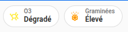
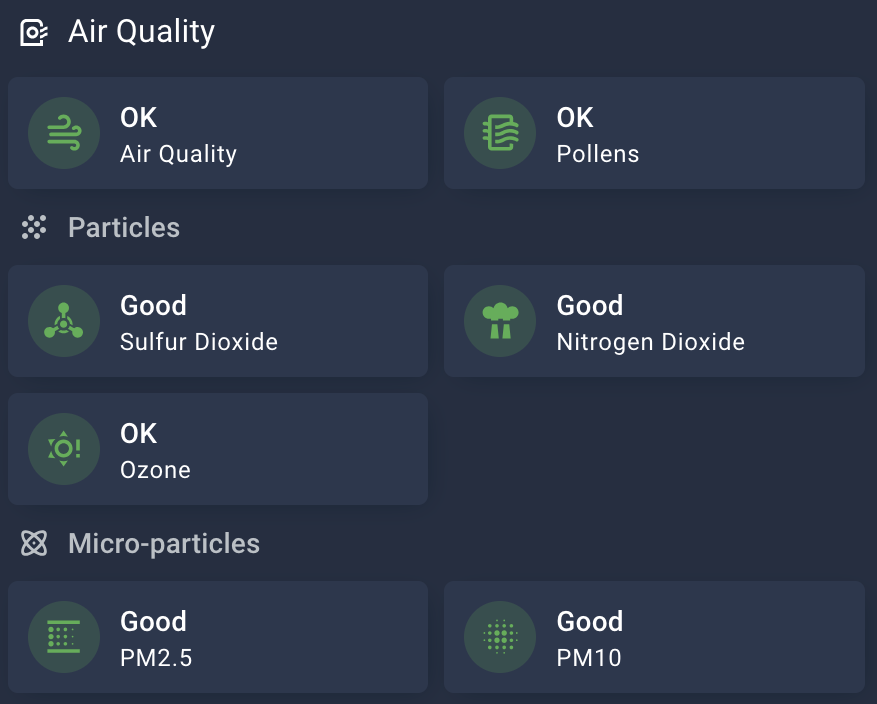

# Atmo France pour Home Assistant


Composant pour exposer les niveaux de pollution atmosphérique et alerte pollen prévus pour le jour même et le lendemain.

Données fournies par Atmo France et les agences régionales.
Voir https://www.atmo-france.org/ pour l'accès web.

L'intégration expose les données d'Atmo France pour une commune donnée.

Les données exposées pour la pollution de l'air sont :

- Niveau de pollution Dioxyde d'Azote (NO<sub>2</sub>)
- Niveau de pollution Ozone (O<sub>3</sub>)
- Niveau de pollution Dioxyde de Soufre (SO<sub>2</sub>)
- Niveau de pollution Particules fines <2.5 µm (Pm25)
- Niveau de pollution Particules fines <10 µm (Pm10)
- Niveau global de qualité de l'air

Les données exposées pour les pollens sont :

- Concentration en Ambroisie (µg/m<sup>3</sup>)
- Concentration en Armoise (µg/m<sup>3</sup>)
- Concentration en Aulne (µg/m<sup>3</sup>)
- Concentration en Bouleau (µg/m<sup>3</sup>)
- Concentration en Graminées (µg/m<sup>3</sup>)
- Concentration en Olivier (µg/m<sup>3</sup>)
- Niveau Ambroisie
- Niveau Armoise
- Niveau Aulne
- Niveau Bouleau
- Niveau Graminées
- Niveau Olivier
- Qualité globale Pollen

Sont disponibles les données pour le jour courant (J) ainsi que les prévisions pour le jour suivant (J+1).

> [!IMPORTANT]
> Prévisions disponibles à J+1, sous réserve de la présence effective des données.
>
> Les données étant rafraîchies à 12h00, entre 00h00 et 12h00 du jour J, les données à J+2 ne sont pas disponibles.
>
> C'est pour cette raison que les prévisions à J+2 ne sont pas implémentées.

## Installation

Utilisez [HACS](https://hacs.xyz/).
[](https://my.home-assistant.io/redirect/hacs_repository/?owner=sebcaps&repository=atmofrance&category=integration)

## Configuration

### Obtenir un accès pour les API Atmo France

- Faire une demande de compte sur le [site Atmo France](https://admindata.atmo-france.org/inscription-api),
- Une fois le compte créé, initialiser le mot de passe via le lien envoyé par mail.
- Ces identifiants (login / mot de passe) sont ceux à utiliser pour la configuration du composant dans Home Assistant.

### Configuration dans Home Assistant

La configuration s'effectue via l'interface utilisateur.

Il faut tout d'abord saisir ses [identifiants d'accès](#obtenir-un-accès-pour-les-api-atmo-france) à l'API.


Puis sélectionner le code postal de la commune dont on souhaite obtenir les données.


> **Note :**
> L'API se base sur le code INSEE. La récupération du code INSEE se fait via l'intégration, mais il peut y avoir plusieurs communes (donc plusieurs codes INSEE) pour un même code postal. Dans ce cas, une étape supplémentaire demande de préciser la commune (sélectionnable dans une liste) pour ne récupérer qu'un code INSEE.


> **Note :**
> Pour certaines régions (Occitanie, Bretagne), les données sont disponibles au niveau de l'[EPCI](https://www.insee.fr/fr/metadonnees/definition/c1160#:~:text=Les%20%C3%A9tablissements%20publics%20de%20coop%C3%A9ration,%C3%A0%20celles%20de%20collectivit%C3%A9s%20locales) et non de la commune.
> L'intégration le détecte automatiquement et affiche les données de l'EPCI à laquelle la commune appartient.
>
> La configuration se fait toujours par le code postal de la commune, mais l'extraction des données au niveau EPCI.

Ensuite, il faut sélectionner le type d'informations souhaité : les indicateurs de pollution et/ou les données concernant les pollens.


Enfin, il faut choisir d'ajouter ou non des prévisions pour les polluants et/ou les données pollens.


> **Note :**
> Lors de la mise à jour du composant depuis une version précédente :
>
> - les données pollens ne sont pas actives. Pour rajouter les données pollens, passer par le menu _Configurer_ de l'entité et activer les indicateurs pollens.
> - les données prévisions ne sont pas actives. Pour rajouter les prévisions, passer par le menu _Configurer_ de l'entité et activer les indicateurs de prévision.


### Données

#### Pollution

Les informations présentées sont les niveaux de pollution sur une échelle de 1 (Bon) à 6 (Extrêmement Mauvais), avec 0 (Indisponible) et 7 (Événement).

Les attributs suivants sont disponibles :

- La date et heure (UTC) de la mise à jour des données par Atmo France. **Les données sont mises à jour une fois par jour par Atmo France.**
- Le libellé du niveau
- La couleur associée au niveau de pollution (couleurs 'officielles' d'Atmo France, au format hexadécimal)
- Le type de zone (commune ou EPCI)
- Le nom de la zone


#### Pollens

Les informations présentées sont les niveaux d'alerte pollen sur une échelle de 1 (Très Faible) à 6 (Extrêmement Élevé), avec 0 (Indisponible) et la concentration des pollens en µg/m<sup>3</sup>.

Les attributs suivants sont disponibles :

- La date et heure (UTC) de la mise à jour des données par Atmo France. **Les données sont mises à jour une fois par jour par Atmo France vers 13h00**
- Le libellé du niveau (**uniquement pour le niveau**)
- La couleur associée au niveau de pollution (couleurs 'officielles' d'Atmo France, au format hexadécimal) (**uniquement pour le niveau**)
- Le type de zone (commune ou EPCI)
- Le nom de la zone


## Suggestion d'affichage

### Carte PollenPrognos
Une carte lovelace supportant cette intégration est disponible et permet l'affichage des données avec une configuration minimale.
Pour l'installation et la configuration, voir [PollenPrognos](https://github.com/krissen/pollenprognos-card).

> [!IMPORTANT]
> Il s'agit d'un projet distinct qui s'occupe de l'affichage des données et qui supporte plusieurs intégration de qualité de l'air.

### Decluttering Card

#### Pollution


#### Pollen


:warning: **Prérequis** Cet affichage se base sur les composants :

- [custom-button-card](https://github.com/custom-cards)
- [decluttering-card](https://github.com/custom-cards/decluttering-card)

Se référer à la doc de chacun des composants pour les détails.

Configuration _modèle decluttering_

```yaml
decluttering_templates:
  atmofrance:
    card:
    type: custom:button-card
    entity: "[[sensor]]"
    name: |
      [[[
      return entity.attributes.friendly_name +' : ' + entity.attributes.Libellé
      ]]]
    styles:
      icon:
        - color: "[[[return entity.attributes.Couleur]]]"
```

Configuration du dashboard principal :

```yaml
type: vertical-stack
cards:
  - type: custom:decluttering-card
    template: atmofrance
    variables:
      - sensor: sensor.qualite_globale_paris
  - type: horizontal-stack
    cards:
      - type: custom:decluttering-card
        template: atmofrance
        variables:
          - sensor: sensor.pm10_paris
      - type: custom:decluttering-card
        template: atmofrance
        variables:
          - sensor: sensor.pm25_paris
      - type: custom:decluttering-card
        template: atmofrance
        variables:
          - sensor: sensor.dioxyde_d_azote_paris
      - type: custom:decluttering-card
        template: atmofrance
        variables:
          - sensor: sensor.ozone_paris
      - type: custom:decluttering-card
        template: atmofrance
        variables:
          - sensor: sensor.dioxyde_de_soufre_paris
```

### Mushroom badge

Une autre façon d'afficher les données sous forme de badge.



:warning: **Prérequis** Cet affichage se base sur le composant :

- [Mushroom](https://github.com/piitaya/lovelace-mushroom)

Configuration du badge :

Cet exemple peut servir de point de départ : vous pouvez personnaliser l'affichage du titre et du contenu selon vos préférences. Dans cet exemple, le titre affiche les principaux polluants et le contenu indique l'indice de qualité de l'air. N'oubliez pas d'adapter les entités à votre configuration.

<details>
  <summary>Afficher le code YAML</summary>

```yaml
type: custom:mushroom-template-badge
entity: sensor.qualite_globale_decines_charpieu
color: "{{state_attr('sensor.qualite_globale_decines_charpieu','Couleur')}}"
tap_action:
  action: more-info
icon: mdi:molecule
content: "{{state_attr('sensor.qualite_globale_decines_charpieu','Libellé')}}"
label: >-
      

  

  

      

  {{ max_labels | join(', ') }}
```

</details>

Le même principe s'applique pour les pollens : le titre affiche la liste des principaux pollens et le contenu indique le niveau de risque pollinique. Modifiez le code YAML en fonction de vos besoins.

<details>
  <summary>Afficher le code YAML</summary>

```yaml
type: custom:mushroom-template-badge
entity: sensor.qualite_globale_pollen_decines_charpieu
color: "{{state_attr('sensor.qualite_globale_pollen_decines_charpieu','Couleur')}}"
tap_action:
  action: more-info
icon: mdi:flower-pollen-outline
content: "{{state_attr('sensor.qualite_globale_pollen_decines_charpieu','Libellé')}}"
label: >-
       

  

  

       

  {{ max_labels | join(', ') }}
```
</details>

### Mushroom cards



<details>
  <summary>Afficher le code YAML</summary>

```yaml
type: grid
cards:
  - type: heading
    heading_style: title
    heading: Air Quality
    icon: mdi:air-purifier
  - type: custom:mushroom-template-card
    entity: sensor.qualite_globale_gap
    primary: >
          Unknown    Good    OK    Bad  Very Bad  Terrible   
    secondary: Air Quality
    icon: mdi:weather-windy
    icon_color: >
        grey  green  yellow  orange  red
      
    tap_action:
      action: more-info
  - type: custom:mushroom-template-card
    entity: sensor.qualite_globale_pollen_gap
    primary: >
          Unknown    Good    OK    Bad  Very Bad  Terrible   
    secondary: Pollens
    icon: mdi:air-filter
    icon_color: >
        grey  green  yellow  orange  red
      
    tap_action:
      action: more-info
  - type: heading
    icon: mdi:grain
    heading: Particles
    heading_style: subtitle
  - type: custom:mushroom-template-card
    entity: sensor.dioxyde_de_soufre_gap
    primary: >
          Unknown    Good    OK    Bad  Very Bad  Terrible   
    secondary: Sulfur Dioxide
    icon: mdi:chemical-weapon
    icon_color: >
        grey  green  yellow  orange  red
      
    tap_action:
      action: more-info
  - type: custom:mushroom-template-card
    entity: sensor.dioxyde_d_azote_gap
    primary: >
          Unknown    Good    OK    Bad  Very Bad  Terrible   
    secondary: Nitrogen Dioxide
    icon: mdi:smog
    icon_color: >
        grey  green  yellow  orange  red
      
    tap_action:
      action: more-info
  - type: custom:mushroom-template-card
    entity: sensor.ozone_gap
    primary: >
          Unknown    Good    OK    Bad  Very Bad  Terrible   
    secondary: Ozone
    icon: mdi:weather-sunny-alert
    icon_color: >
        grey  green  yellow  orange  red
      
    tap_action:
      action: more-info
  - type: heading
    icon: mdi:atom
    heading: Micro-particles
    heading_style: subtitle
  - type: custom:mushroom-template-card
    entity: sensor.pm25_gap
    primary: >
          Unknown    Good    OK    Bad  Very Bad  Terrible   
    secondary: PM2.5
    icon: mdi:blur-linear
    icon_color: >
        grey  green  yellow  orange  red
      
    tap_action:
      action: more-info
  - type: custom:mushroom-template-card
    entity: sensor.pm10_gap
    primary: >
          Unknown    Good    OK    Bad  Very Bad  Terrible   
    secondary: PM10
    icon: mdi:blur
    icon_color: >
        grey  green  yellow  orange  red
      
    tap_action:
      action: more-info
```

</details>